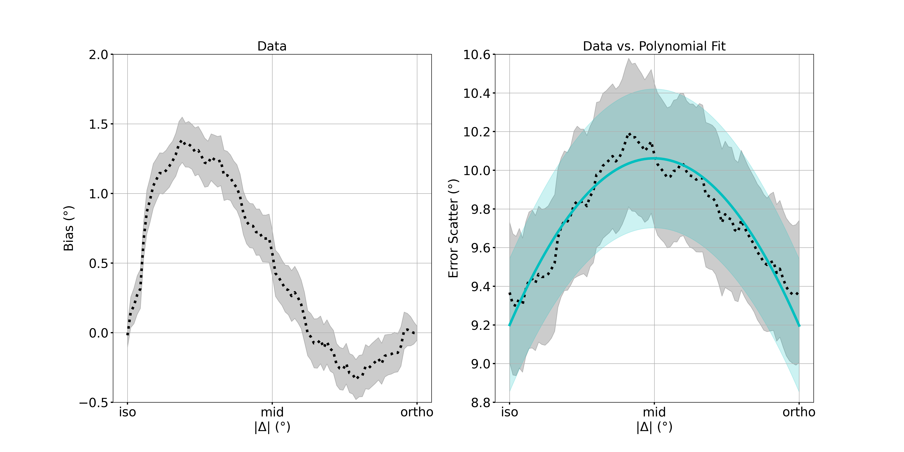

# Rethinking serial dependence: A large-scale analysis of its effects on the variability of perceptual estimates  


Welcome to the **Rethinking serial dependence: A large-scale analysis of its effects on the variability of perceptual estimates** repository. This project allows users to analyze the effects of serial dependence on the response variability in adjustment tasks

## Main Results (PDF)

[View the main results PDF](figures/main_results_polyfit.pdf)

## Summary of Studies

The table below is generated from `tables/summary_studies.csv`:

```html
<div id="summary-table"></div>
<script>
  fetch('tables/summary_studies.csv')
    .then(response => response.text())
    .then(text => {
      const table = document.getElementById('summary-table');
      const rows = text.trim().split('\n');
      rows.forEach((row, rowIndex) => {
        const tr = document.createElement('tr');
        row.split(';').forEach(cell => {
          const cellElem = document.createElement(rowIndex === 0 ? 'th' : 'td');
          cellElem.textContent = cell;
          tr.appendChild(cellElem);
        });
        table.appendChild(tr);
      });
    })
    .catch(err => console.error('Error loading CSV:', err));
</script>
```


## Figures Gallery


